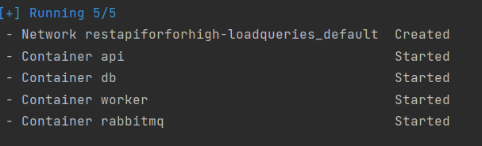

# RestAPIForHigh-loadQueries


---

## About

Simple implementation of web applications for high-load tasks implemented using
the Fast API framework for REST API and RabbitMQ with using framework
pika\aio_pika.

Using the REST API, the user submits a task to a queue implemented using RabbitMQ. 
The worker, in turn, retrieves the message from the queue and processes the task. 
If an error occurs during the processing of the message, it will be sent to a second 
queue designed to collect errors (this is implemented using dead-letter-exchange).  
A separate handler is available in the REST API for viewing such tasks.

**P.s. Python version 3.11 is required for the web application to work correctly**


### The repository contains the following components:
* **[About](#About)**
* **[Rest-API-Structure](#Rest-API-Structure)**
    * [Queue](#Queues)
    * [Result](#Results)
    * [Start-RestAPI](#Start-RestAPI)
* **[Worker](#Worker)**
    * [About-Queues](#About-Queues)
    * [About-Queues](#About-Workers)
    * [Start-Worker](#Start-Worker)
* **[Database](#Database)**
* **[Docker](#Docker)**


## Rest API Structure

The web application consists of two modules:
* Queues - create and view queues of tasks
* Results - viewing the results of tasks 


---
### Queue

Consists the following handlers:
* POST /api/v1/queue/ - create task 
* GET /api/v1/queue/{number_queues} - viewing tasks in queues

---
### Result

Consists the following handlers:
* GET /api/v1/result/ - select list results
* GET /api/v1/result/{result_uuid} - select result by uuid 

---
### Start RestAPI

1. Go to the directory `src`
```shell
cd src
```
2. Create `.env` file with
```shell 
touch .env
```
3. Add variable in the `.env` file
```
DB_HOST=
DB_PORT=
DB_NAME=
DB_USER=
DB_PASS=

RMQ_HOST=
RMQ_PORT=
RMQ_USER=
RMQ_PASSWORD=

RMQ_QUEUE_EXCHANGE=
RMQ_QUEUE_ROUTING_KEY=
RMQ_QUEUE_NAME=
RMQ_QUEUE_DEAD_LETTER_EXCHANGE=
RMQ_QUEUE_ROUTING_KEY_DEAD_LETTER=
RMQ_QUEUE_DEAD_LETTER_NAME=
```
4. Install packages
```shell
pip install -r requirements.txt
```
5. Run Rest API
```shell
uvicorn app:app --reload
```
---

## Worker
### About-Queues

Application have 2 queues:
* main tasks
* dead-letter tasks

The first category includes messages sent by the user using the REST API. 
The aio_pika library is used for this, it allows you to connect to RabbitMQ asynchronously
without blocking the main thread.

The second row includes messages that were executed with an error.


### About-Workers

The worker is a simple mechanism that uses the pika framework to connect to a queue and 
extract tasks from it, and then processes the task and starts the engine to process it.

The worker implies the use of dle in case of an error, therefore, to emulate 
the occurrence of an error, a number from 1 to 100 is generated and if it exceeds 80, 
the error is emulated.

If necessary, you can run several task processing workers and they will automatically take
tasks due to the parameter `ch.basic_qos(prefetch_count=1)`. 


### Start-Worker

1. Go to the directory `worker`
```shell
cd worker
```
2. Create `.env` file with
```shell 
touch .env
```
3. Add variable in the `.env` file
```
DB_HOST=
DB_PORT=
DB_NAME=
DB_USER=
DB_PASS=

RMQ_HOST=
RMQ_PORT=
RMQ_USER=
RMQ_PASSWORD=

RMQ_QUEUE_EXCHANGE=
RMQ_QUEUE_ROUTING_KEY=
RMQ_QUEUE_NAME=
RMQ_QUEUE_DEAD_LETTER_EXCHANGE=
RMQ_QUEUE_ROUTING_KEY_DEAD_LETTER=
RMQ_QUEUE_DEAD_LETTER_NAME=
```
4. Install packages
```shell
pip install -r requirements.txt
```
5. Run Rest API
```shell
python3 worker.py
```

## Database

For the Rest API to work correctly, you need to create a database with the data 
described in the file `./src/models/models.py`. You can do this yourself or 
perform migrations by following the instructions below.

**P.s. The instructions imply that the required database has already been created**

1. Go to the directory `database`
```shell
cd database
```
2. Create `.env` file with
```shell 
touch .env
```
3. Add variable in the `.env` file
```
DB_HOST=
DB_PORT=
DB_NAME=
DB_USER=
DB_PASS=
```
4. Run command
```shell
alembic upgrade head
```

## Docker

To run the application in the background, use Docker to run it, use the command.
```shell
docker-compose up -d --build
```
If everything was successful, you will see the following entries in the console




To turn off the application, use the command (if you want to turn it off with data loss, add the ` -v` flag)
```shell
docker-compose down
```
If everything was successful, you will see the following entries in the console

